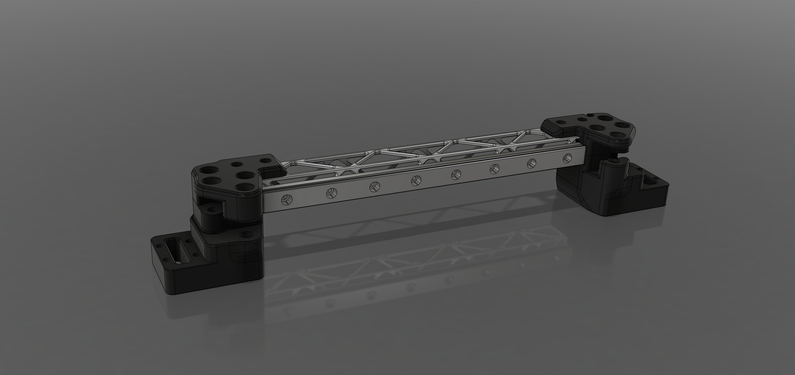

<h2>X Beam STL Files</h2>

Modified XY joints for Tiny-T with the X-Ultralight from [WKS-3D](https://wks-3d.de/)	

The centering lugs must be removed from the XY joints. Here you can download the correct STL files.

[SirRenix](https://github.com/SirRenix) has designed Hexnut Inserts to allow easier mounting to the XY Joints. 

#Pictures

