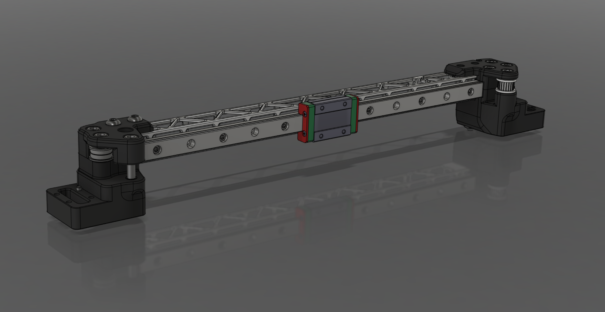

<h2>X Beam STL Files</h2>

Modified XY joints for V2.4 & Trident with the X-Beams from [WKS-3D](https://wks-3d.de/)	

The centering lugs must be removed from the XY joints. Here you can download the correct STL files.

Print the assamble tool 1 time to be able to screw on the nuts

# V2.4 & Trident

